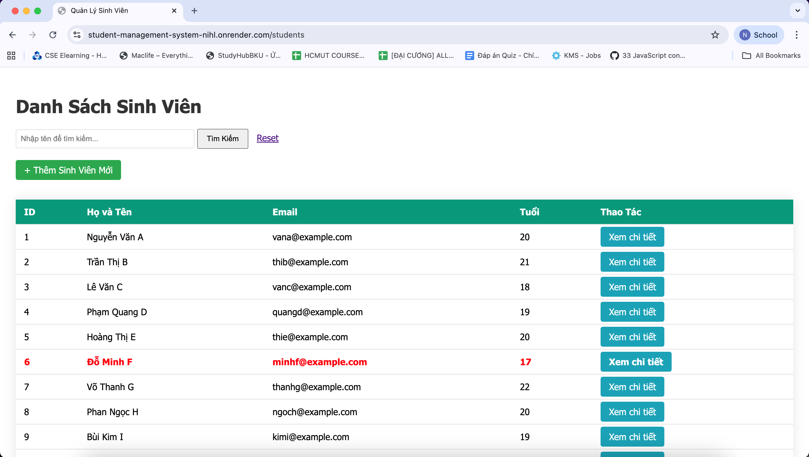
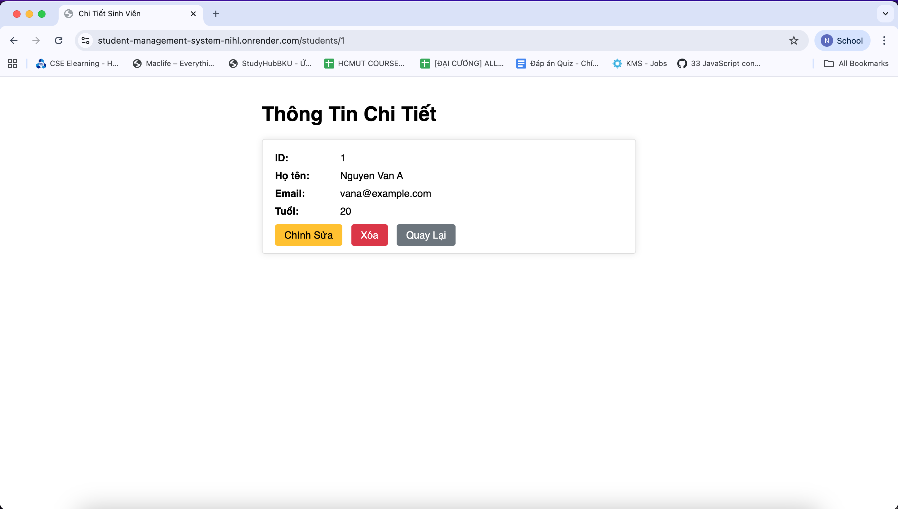
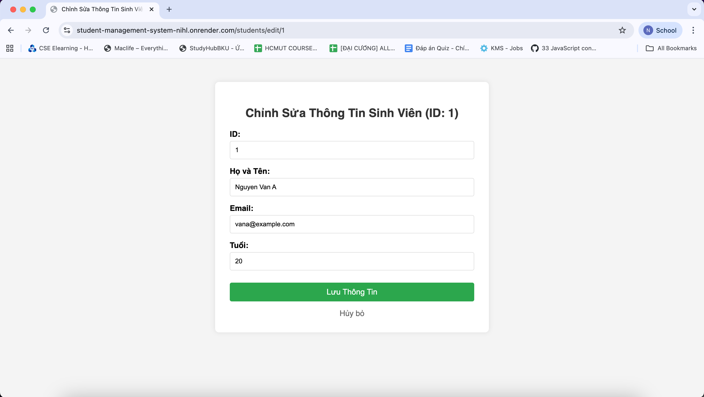
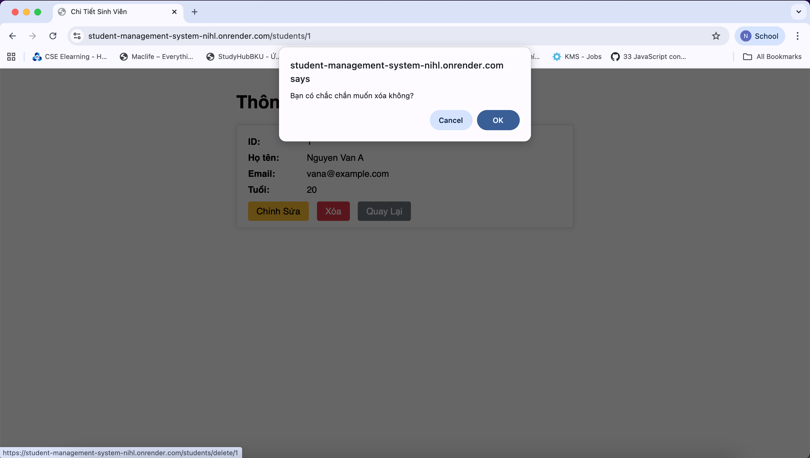

# Student Management System - Web App Căn Bản

Dự án xây dựng ứng dụng quản lý sinh viên sử dụng Java Spring Boot, Thymeleaf và PostgreSQL. Đây là bài tập thực hành thuộc môn Công nghệ Phần mềm Nâng cao.

## 1. Thông Tin Nhóm
* **Môn học:** Công nghệ Phần mềm Nâng cao
* **Thành viên:**

| No. | Full Name | Student ID |
| :--- | :--- | :--- |
| 1 | Trần Khánh An | 2310037 |
| 2 | Trần Dương Khiết Nhi | 2312509 |

## 2. Demo & Triển Khai (Deployment)
Ứng dụng đã được triển khai thành công trên Render và Neon Database.
* **Public URL:** https://student-management-system-nihl.onrender.com/students

## 3. Hướng Dẫn Cài Đặt & Chạy (Local)

### Yêu cầu hệ thống
* Java Development Kit (JDK) 17 trở lên.
* Maven.
* PostgreSQL (hoặc sử dụng Docker/Neon).

### Các bước thực hiện
1.  **Clone dự án:**
    ```bash
    git clone https://github.com/khietnhii/CNPMNC-StudentManagementSystem.git
    cd CNPMNC-StudentManagementSystem
    ```

2.  **Cấu hình Database:**
    * Tạo file `.env` tại thư mục gốc (hoặc cấu hình trực tiếp trong IDE/Environment Variables) với các thông số:
    ```properties
    POSTGRES_HOST=localhost
    POSTGRES_PORT=5432
    POSTGRES_DB=student_management
    POSTGRES_USER=postgres
    POSTGRES_PASSWORD=[MẬT_KHẨU_CỦA_BẠN]
    ```

3.  **Chạy ứng dụng:**
    Mở terminal tại thư mục gốc và chạy lệnh:
    ```bash
    ./mvnw spring-boot:run
    ```

4.  **Truy cập:**
    Mở trình duyệt và vào địa chỉ: `http://localhost:8080/students`

## 4. Ảnh Chụp Màn Hình (Lab 4)

**4.1. Trang Danh sách Sinh viên (List View)**


**4.2. Form Thêm Sinh viên Mới (Add New)**


**4.3. Trang Chi Tiết (Detail View)**


**4.4. Form Chỉnh Sửa (Edit)**


**4.5. Chức năng Xóa (Delete)**

&nbsp;

## 5. Trả Lời Câu Hỏi Lý Thuyết (Lab 1)

Dưới đây là câu trả lời cho các câu hỏi bài tập trong Lab 1 (Phần 8):

**Câu 2: Ràng buộc Khóa Chính (Primary Key)**
* **Hiện tượng:** Khi cố tình Insert một sinh viên có `id` trùng với một người đã có sẵn, Database báo lỗi `UNIQUE constraint failed`.
* **Giải thích:** Khóa chính (`PRIMARY KEY`) trong Cơ sở dữ liệu quan hệ yêu cầu giá trị phải là duy nhất để định danh từng bản ghi. Database chặn thao tác này để đảm bảo tính toàn vẹn dữ liệu, tránh việc hai thực thể khác nhau có cùng một mã định danh.

**Câu 3: Toàn vẹn dữ liệu (Constraints)**
* **Hiện tượng:** Khi Insert sinh viên mà bỏ trống cột `name` (để NULL).
* **Giải thích:** Nếu cột được định nghĩa là `NOT NULL`, Database sẽ báo lỗi. Nếu cột cho phép NULL, Database vẫn chấp nhận. Tuy nhiên, khi code Java đọc dữ liệu lên, nếu Entity khai báo `String name` mà không xử lý null, có thể gây ra lỗi `NullPointerException` khi thao tác trên giao diện hoặc logic nghiệp vụ, làm ứng dụng bị crash hoặc hiển thị sai lệch.

**Câu 4: Cấu hình Hibernate**
* **Hiện tượng:** Mỗi lần tắt ứng dụng và chạy lại, dữ liệu cũ bị mất hết.
* **Giải thích:** Do trong file `application.properties` (Lab 1) ta cấu hình `spring.jpa.hibernate.ddl-auto=create`. Chế độ `create` chỉ thị cho Hibernate xóa toàn bộ schema (Drop tables) và tạo lại mới mỗi khi khởi động SessionFactory. Để giữ lại dữ liệu, ta cần đổi thành `update` hoặc `none`.

---
*Cảm ơn Thầy đã xem bài nộp của nhóm chúng em!*